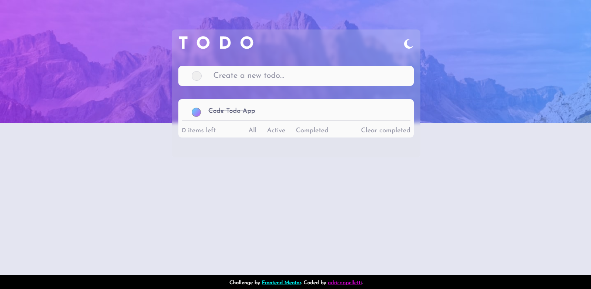

# Frontend Mentor - Todo app

-ENGLISH- 
Todo app that allows you to keep track of your daily tasks, navigate betwen those who are active and completed, and clear the ones you already completed.
Also it uses LocalStorage to save your tasks for the nex time you open your browser 
 
-ESPAÑOL- 
Todo app te permite llevar el control de tus tareas diarias. Podes navegar entre las que estan activas, completas y borrar las que ya terminaste.
Ademas utiliza LocalStorage para guardar tus tareas para la proxima vez que abras tu navegador.
 

DEMO = () => https://adricappelletti.github.io/Todo-app/

## Technologies 

<a href="https://developer.mozilla.org/en-US/docs/Glossary/HTML5" target="_blank">  HTML5
</a>  
 <a href="https://www.w3schools.com/css/" target="_blank">  CSS3</a>  
 <a href="https://developer.mozilla.org/en-US/docs/Web/JavaScript" target="_blank">  JavaScript Vanilla</a>

